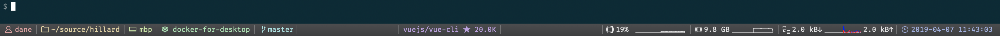
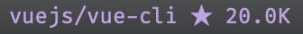
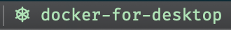
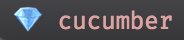

# iterm-components

Custom status bar components for use with iTerm2

## Components

### GitHub stars

Shows the current number of stars for the specified repository.
Clicking on the text takes you to the repo in your default browser.
You can add a personal access token in order to minimize rate limiting or to keep tabs on a private repository.

### `kubectl` context

Shows the active `kubectl` context.

### environment variable (work in progress)

Shows the current value of an environment variable, with the option to show or hide the variable name.

### `pyenv`

Shows the active Python version or virtual environment.

### `rvm` gemset

Shows the active gemset.

### Generic command

Display the stdout from an arbitrary command.

## Installation

You can install the scripts to iTerm2's AutoLaunch folder with `./install.sh`.
Select **Scripts > AutoLaunch** in the iTerm2 menu bar and select the scripts you want to be available as status bar components.
You may be prompted to download the Python runtime.
They should then be available to configure.

### Configuring the components

After the components you want are present in the `AutoLaunch` folder and selected in the **Scripts > AutoLaunch** menu, iTerm2 should make them available to use.

Read [the instructions for using status bar components](https://www.iterm2.com/3.3/documentation-status-bar.html) and drag them where you like.
